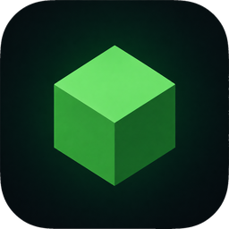

<div align="center">



# Dyni

**Лаунчер Minecraft: Java Edition для Windows — мощный, но не раздутый.**

Единый каталог Modrinth + CurseForge, загрузчики модов, офлайн-скины прямо в игре,
Yggdrasil-аккаунты, темы с живым фоном и бесшовное самообновление —
всё в одном самодостаточном `.exe`.

<br/>

[](https://github.com/ExtraTools/DyniLauncher/releases/latest)
[](https://github.com/ExtraTools/DyniLauncher/releases)
[](#)
[](LICENSE)


[Скачать](#загрузка) · [Возможности](#возможности) · [Быстрый старт](#быстрый-старт) · [Темы](#темы-и-внешний-вид) · [Сборка](#сборка-из-исходников) · [Changelog](CHANGELOG.md)

</div>

---

## Возможности

| | |
| --- | --- |
| **Каталог контента** | Единый поиск **Modrinth + CurseForge**: моды, модпаки, ресурспаки, шейдеры, миры. Установка в один клик, выбор версии, проверка хешей, авто-зависимости. |
| **Загрузчики модов** | **Fabric · Quilt · Forge · NeoForge** с авто-подбором совместимой версии под выбранный Minecraft. |
| **Модпаки** | Установка готовых `.mrpack` и экспорт своей сборки. Снимок миров и конфигов одной кнопкой перед рискованным апгрейдом. |
| **Аккаунты** | Offline (по нику), **Microsoft** (вход по коду, проверка лицензии) и **Yggdrasil** — ely.by / LittleSkin / свой сервер. Поиск, фильтр и массовое управление. |
| **Скины и плащи** | 3D-превью с вращением, смена модели рук, drag-and-drop PNG. **Офлайн-скины прямо в игре** через локальный skin-сервер (authlib-injector). |
| **Запуск и Java** | Авто-установка нужного рантайма Mojang + детект системной Java. **11 готовых JVM-пресетов** с описанием и версионно-безопасными флагами. Живой лог игры и монитор CPU/RAM. |
| **Контент профиля** | Миры, серверы с быстрым входом, ресурспаки и шейдеры. Бэкапы миров со снапшотами, тегами, политикой хранения и дедупликацией. |
| **Темы и внешний вид** | Палитры **Grove · Nova · Frost · Ember** + плоские **Dark / AMOLED**, **живой шейдерный фон** под цвет темы, дизер-обложки версий и живые аватарки. |
| **Удобство** | Командная палитра <kbd>Ctrl</kbd> + <kbd>K</kbd>, поиск по настройкам, горячие клавиши, перетаскивание файлов в окно, Discord Rich Presence. |
| **Обновления** | **Бесшовное самообновление** — лаунчер сам качает новую версию, заменяет себя и перезапускается. Без мастера установки. |
| **Движок загрузки** | Параллельно, с проверкой SHA1, атомарной записью и ретраями. Общий контент-адресный кэш — файлы не дублируются между инстансами. |

## Загрузка

Последняя версия — в разделе [**Releases**](https://github.com/ExtraTools/DyniLauncher/releases/latest).

| Файл | Что это |
| --- | --- |
| **`Dyni.exe`** | Портативная версия — просто запусти (нужен WebView2, есть на Windows 10/11) |
| **`Dyni_<версия>_x64-setup.exe`** | Установщик (NSIS): ярлык в меню, авто-обновление |

> Уже пользуешься Dyni? Жми «Обновить» прямо в лаунчере — он сам поставит новую версию без установщика.

## Быстрый старт

1. Запусти `Dyni.exe` (или поставь установщиком).
2. Слева добавь **offline-аккаунт** по нику или войди через **Microsoft** / **ely.by**.
3. Нажми **+** и создай версию — выбери загрузчик и Minecraft (например, `1.20.4` или `1.21`).
4. Жми **«Играть»** — пойдёт установка: метаданные → Java → файлы → запуск.

> Подсказка: <kbd>Ctrl</kbd> + <kbd>K</kbd> — командная палитра, <kbd>Ctrl</kbd> + <kbd>F</kbd> — поиск, <kbd>Ctrl</kbd> + <kbd>,</kbd> — настройки.

## Темы и внешний вид

Шесть тем перекрашивают весь лаунчер: **Grove**, **Nova**, **Frost**, **Ember**, а также плоские
**Dark** и **AMOLED** для OLED. Включи **живой фон** в _Настройки → Внешний вид_ — атмосферный
шейдерный поток перетекает под цвет темы; выключи — спокойный статичный фон. Для слабых ПК есть
режим «без анимаций».

## Настройка

- **Microsoft-вход** использует свой Azure-app (device-code + доступ к Minecraft API). Свой id задаётся переменной окружения `DYNI_AZURE_CLIENT_ID`.
- **Данные** хранятся в `%APPDATA%\.Dyni\` — приватная папка, не общий `.minecraft`.
- **Авто-обновление**: адрес и подпись настраиваются в `tauri.conf.json` (`plugins.updater`); приватный ключ лежит в `src-tauri\.keys\` и в репозиторий не попадает.

## Сборка из исходников

```powershell
pnpm install
pnpm tauri dev      # режим разработки
pnpm tauri build    # сборка exe + установщика
```

Нужны **Rust** (stable-msvc), **MSVC build tools**, **Node** и **pnpm**.

<details>
<summary>Структура проекта</summary>

| Путь | Что внутри |
| --- | --- |
| `src/` | Фронтенд — React + TypeScript + Vite (UI, экраны, темы) |
| `src-tauri/` | Tauri-приложение (`launcher-app`) — окно, IPC, бандл |
| `crates/launcher-core/` | Ядро на Rust — загрузка, запуск, аккаунты, контент |

</details>

## История изменений

Полный список релизов и изменений — в [CHANGELOG.md](CHANGELOG.md).

## Лицензия

[MIT](LICENSE) © 2026 **WaitDino**.

> Неофициальный лаунчер. Требуется легально приобретённая копия Minecraft.
> Проект не связан с Mojang или Microsoft.
